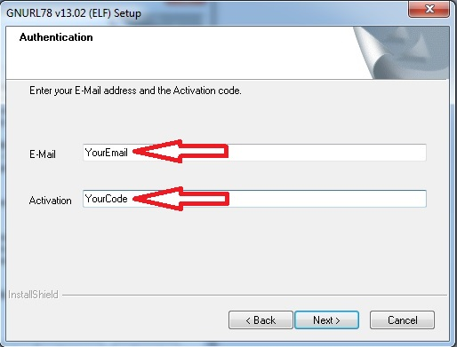

.. index:: E2Inst

.. _E2studio Suite Install:

Installing E2studio Developement Suite
**************************************

| **This small guide is intended to explain the main steps to properly install the E2studio developement suite.**
| **As possibly not shown here, refer to the E2studio quick start guide r20ut2771ej0100_e2_start_s.pdf.**
| **All steps here described are performed with WINDOWS 7 OS**

First step
----------

Download E2studio version 2.2.0.13 and KPIT GNURL78 Version 13.02-ELF-MP1. Yuo can find how to make here :ref:`toolset` for tools setup

You must have these two files:

Then, you are ready for E2studio Developement Suite setup.

Starting Install E2studio environment
-------------------------------------

| Double click on **Renesas_e2_studio_2.2.0.13.exe**.
| First of all, it will ask you to upgrade these OS system settings. If your OS is already updated, this popup will not open

Wait for OS system update. This can take much time

When update ends E2studio starts decompressing

When the followiong sceern will appear, you are ready to install E2studio suite:

click "next" button, and setup will ask you to agree license  

check 'I accept ...' then click "next" 

leave unchanged the destination folder and click "next" button

click "install" button to start intallation

E2studio installation steps
-----------------------------

Wait for Wizard operations end.

Now Wizard ask for harware device driver installation: for every popup, click "Install" button 

.. image:: _images/install_3c.jpg

.. image:: _images/install_3e.jpg

Wait for E2studio validation

E2 studio succesfull installed on your system

click "Finish" to end wizard.

Installing GNURL78 KPIT compiler
--------------------------------

Double click on **GNURL78v1302-ELF-MP1.exe**.

When wizard starts, a first popup will appear

Leave unchanged "Default" radio button an click "OK"

.. important::
 The steps following are needed only first time you install GNURL78 compiler.
 The data needed for activate license are in the email received after registration ::ref:`email` 

GNURL78 wizard now ask for activation code. Check "I am a registered user", then click "Next" button and take care at registration email.

**Insert YorEmail and YourCode as received in GNURL78 registration email and then click "Next" button**

Click "Next" button

Click "Yes" button to agree License

GNURL78 wizard ask for confirm E2studio toolchain integration. Check and click "Next" button

Wait for wizard ...

GNURL78 features settings. Set as image above then click "Next" button

GNURL78 install folder. Leave unchanged then click "Next" button

GNURL78 settings summary. Click "Next" button

Wait for GNURL78 integration inside E2studio suite

Activation of GNURL78 Maintenance Pack 1. Click "Next" button

GNURL78 compiler successfull installed and configured for E2studio suite! 

