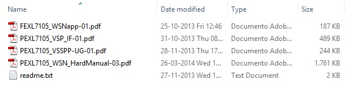
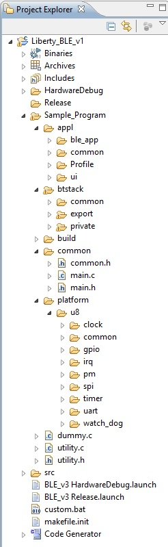
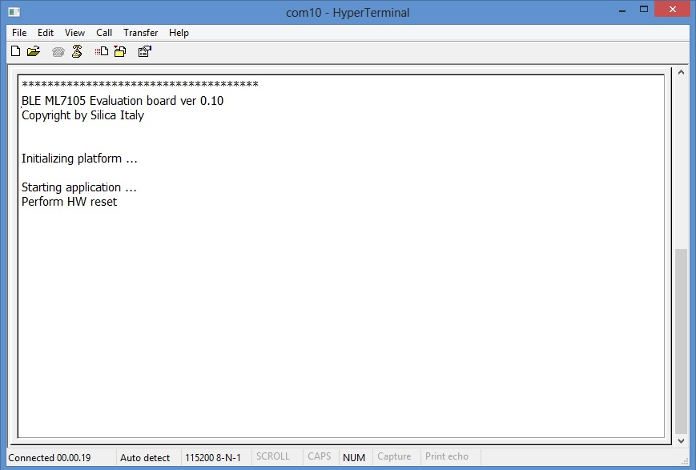
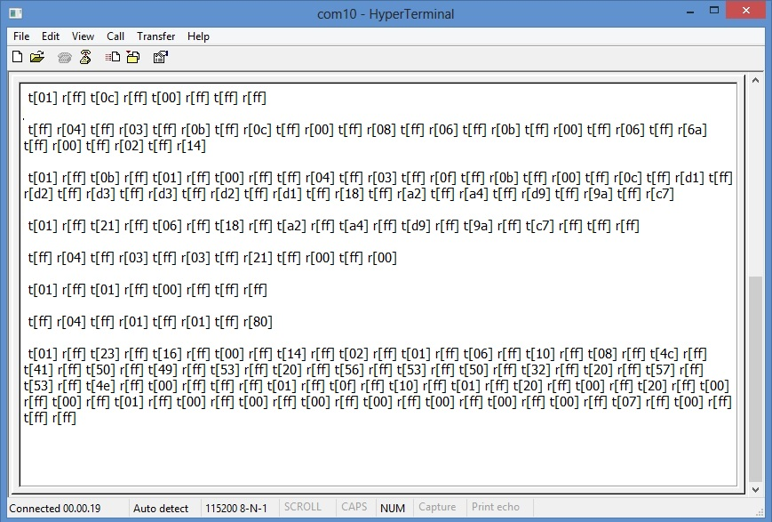

.. index:: PrjFiles

Firmware specification
**********************

Firmware overview
-----------------

| The Liberty_BLE_v1 firmware has been developed starting from **VSSPP_ML610QXXX_Ver0_094_beta** firmware revision developed from Lapis to use with your PEXL7105_WSN kit.
| This "beta" revision include basic BLE stack, an example of GATT database and some function that may be usefull for end-user application development.
| More detail regarding ML7105 application and "beta" firmware can be found in "BLE_doc\\ML7105_kit" folder included in Liberty_doc.zip archive file

| Other documents:
| **FEXL7105_BACI_Manual-01.pdf** --- ML7105 Baci reference guide 
| **FEXL7105_AppDevelopersGuide-01.pdf** --- Summary of basic BLE stack functions
| 

Firmware restrictions
---------------------

| The Libert_BLE_v1 firmware assumes the following restrictions:
| • It is designed and configured only for VSP application.
| • No testing has been made for VSSPP application.
| • No very Low Power mode available. Liberty low-power mode is only for evaluation
| • Support few examples of ATT and GATT database (only basic tables)
| • There will be no security implemented.
| 

Main firmware features
----------------------

Liberty_BLE_v1 firmware is designed for demo application. It's also possible, starting from it, to develope user's application. In this case, debug and testing are charged to the end user. 

By using PC or SmartPhone Liberty Software, you can perform:

 - Reading or writing caracteristic handle
 - Discover and pair device
 - Read sensor's data stored in GATT database
 - Read sensor's data immediatly (real time value)
 - ON/OFF blue led

Liberty firmware also "dump" continuosly the communication between Renesas CPu an ML7105 module. Please refer to :ref:`hwset` in "Quick Start Guide"

Project structure
-----------------

The application’s file structure includes the following folders:

• **Sample_Program** – contains source files imported from VSSPP_ML610QXXX_Ver0_094_beta
	• **appl** specific BLE application file 
	• **btstack** specific BLE stack management application file 
	• **common** BLE application main file and common definition
	• **platform** specific Platform application file: U8 suffix original file are adapted fo Renesas CCPU
	
• **src** – Renesas RL78 Hardware setup and driver (generated by Code Generator integrated in E2studio)

Brief of firmware performance
-----------------------------

The firmware will include a minimal example to initialize the ML7105 and functions to store periodically (every 30 seconds) the sensors data and to perform pairing with PC or SmartPhone. When paired, using a PC or SmartPhone Liberty Software application, it's also possible to read/write both Characteristic Value Handle and Caracteristic UUID, set/clear periodically notify (only for Accelerometer data), read Temperature value and Accelerometer data (periodically stored by 30 seconds internal timer) or make a flash read of data from sensors (Temperature and Accelerometer). It's also possible (writing into reserved Caracteristic Value Handle) turn on and turn off the blue LED on the board.

Using "dump" you can see and store all BACI packet between RL78 cpu and ML7105 BLE module, and you can analyze much more detail about Liberty Board state.

When board startup, in the terminal windows you can see

The RED led will on, and in a few seconds start the initial settings communication.
Here above the last BACI packets that end initial settings

| **t[hex value] means data from CPU to MODULE**
| **r[hex value] means data from MODULE to CPU**
| 

The green led flash (50msec every 2 seconds) to indicate that Liberty is in standby state, waiting for connection or pairing.
When in this state, every 180 seconds the firmware will reset thne ML7105 module and clear pairing information stored in the eeprom

If connection is established, the green led lamps regullary (0,5 seconds ON, 0,5 seconds OFF) to indicate that Liberty is in active state, but not yet paired. When in active state, after 180 seconds the firmware reset the module as when in standby state

| The funcion called to perform this is: 
| **BLEutil_StartTimer( BLE_APP_TIM_PAIR_INFO_CLEAR, BLE_TIM_180S, BLE_App_Pairing_Info_Clear_Timer_Handler )**

*(see inside file ble_app.c at function BLE_App_Fsm)*

When green led ligth on, Liberty is active and paired. The 180 seconds timer is disabled.

.. note::
  **Yellow led will flash when Liberty are in "unpaired state" (not yet cleared pairing informations stored in the module). In this state, connection or pairing requests are refused.
  You must wait for expire of pairing timeout (about 30 seconds). The green led will return as in standby state and new connections are enabled.**

Low-power evaluation
--------------------

Liberty Firmware has a low-power mode capability (only for demo purpose) When compiling, the Macro define **LOWP_EN** is used to enable/disable auto low-power mode. If enabled, when a 60 seconds timer expires, CPU will enter in stop mode. The CPU will awake from ML7105 IRQ request. 

.. important::
 **Low Power evaluation with I[average]<80uA is available ONLY WHEN ML7105 IS PAIRED. The Low Power evaluation mode, if entered when ML7105 is unpaired, take a current I[average] of about 2mA. This is because ML7105 (if not yet paired) enable power to radio reception every 5msec.**
 
 *The maximum time before battery cutoff is about 2000 hours (whith device paired, receive and transmit never used)*
 
**Note**: default setting for macro **LOWP_EN** is **TRUE** (Low-power enabled)

*The 60 seconds low-power timer will recharge every time that ML7105 assert IRQ signal*

  
Firmware & documents download
-----------------------------

Firmware project file Liberty.zip and Liberty_doc.zip can be found at Silica ArchiTech page. Registration is needed to access at download section.
Click `here <http://www.silica.com/architech.html>`_ to go to ArchiTech main page.

