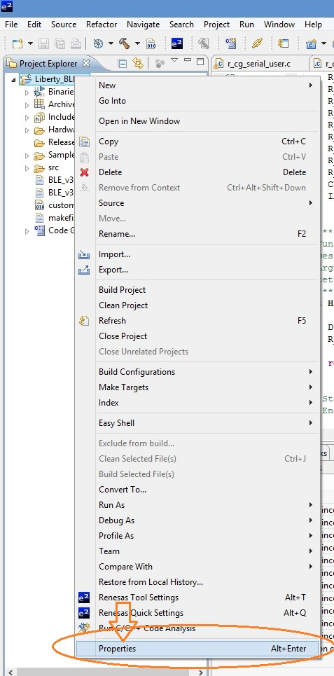
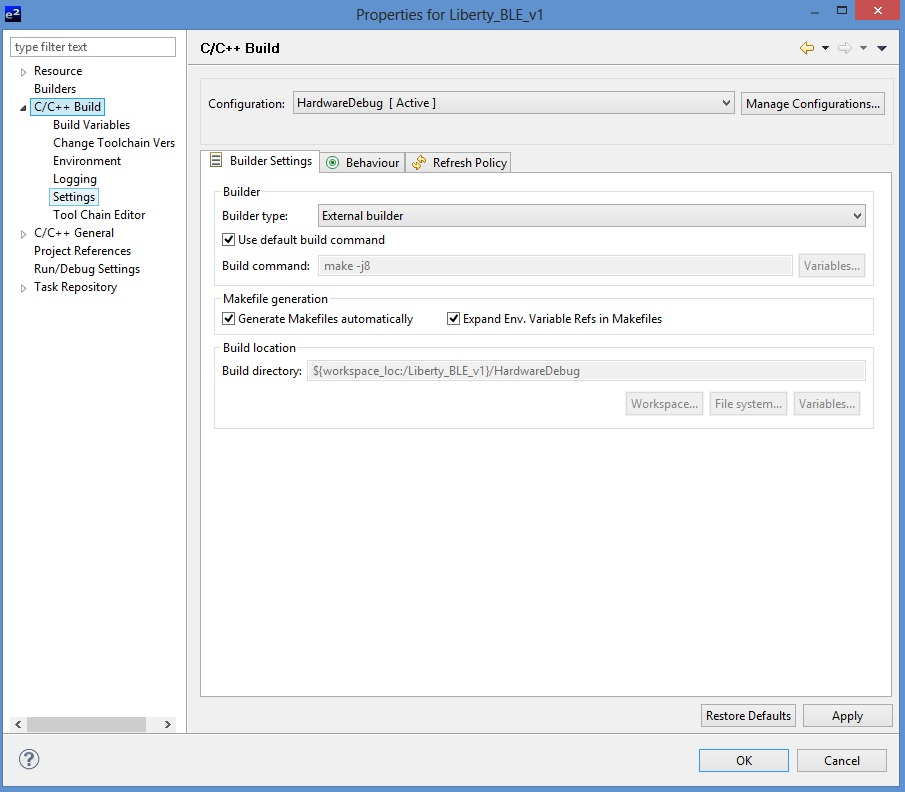
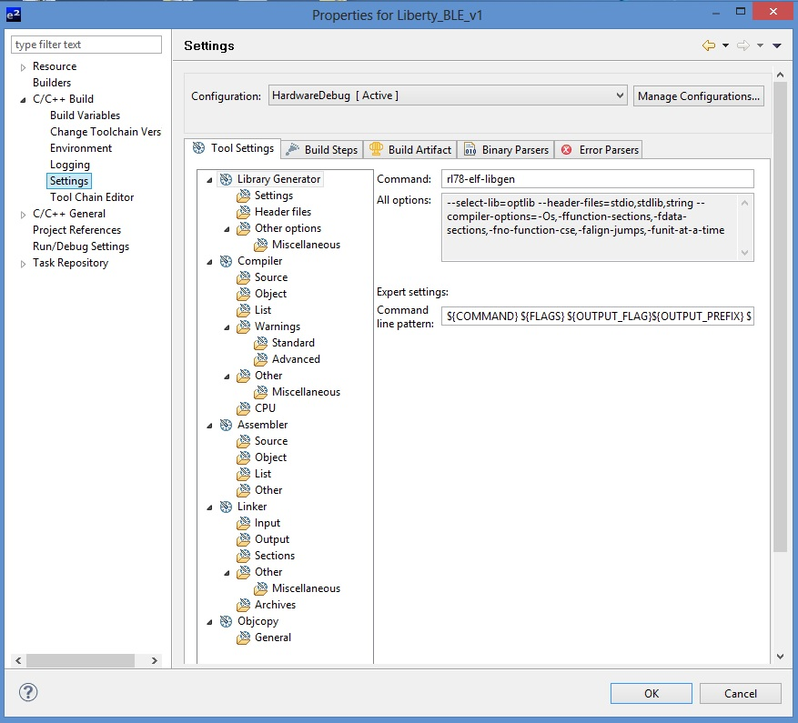
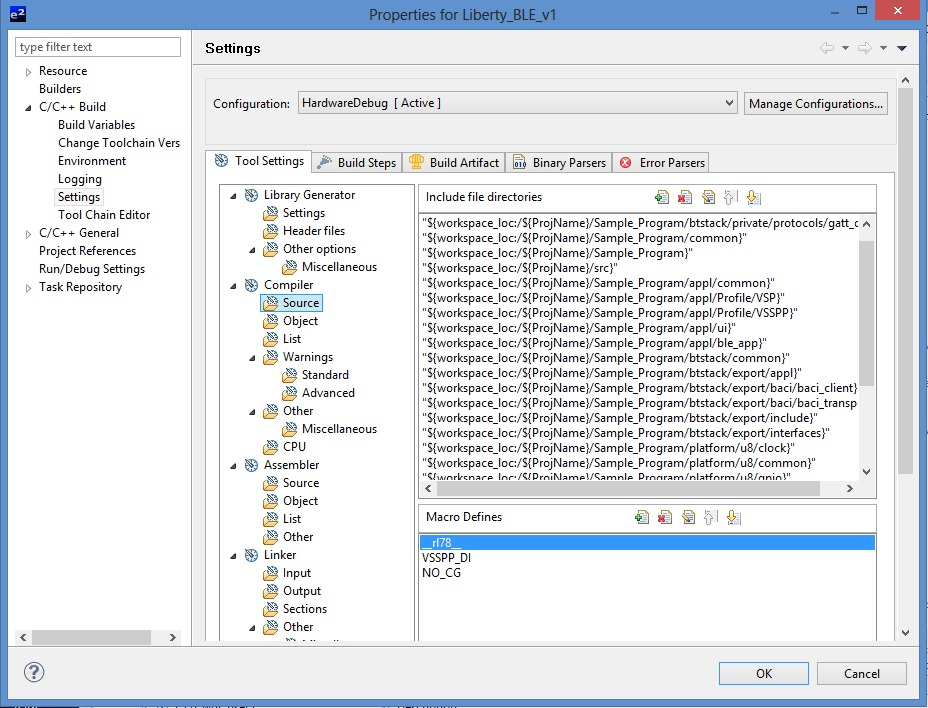
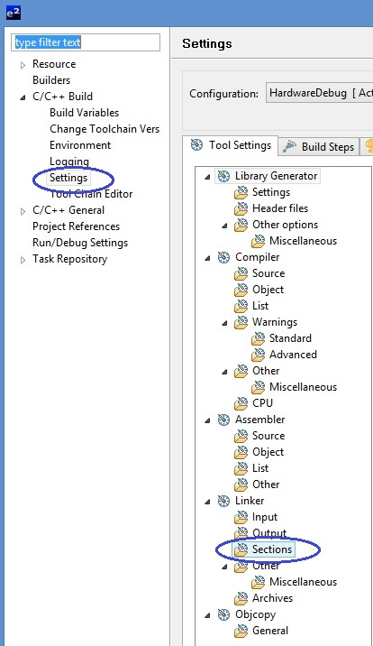
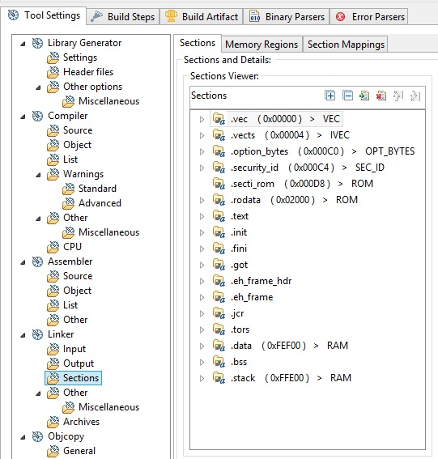
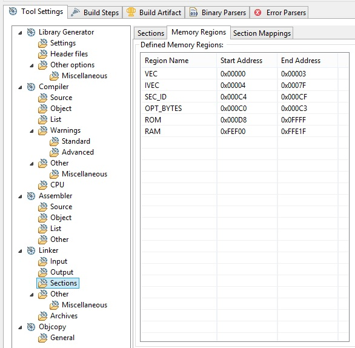
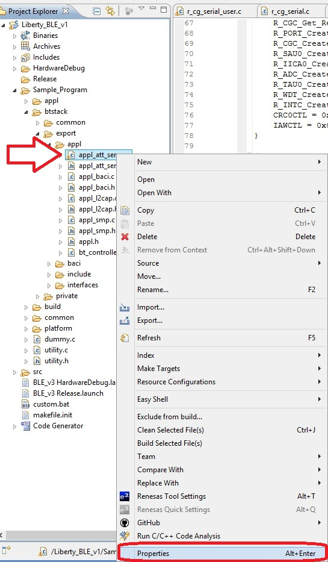
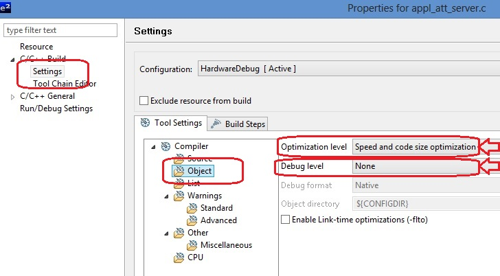

.. index:: ftips

Project tips
************
.. important::

 **Liberty_BLE_v1 firmware use "Code Generator" as integrated in E2studio suite to make source file for vector table, hardware driver and reset.**
 **For more detail about, read** `Code Generator user's manual <http://documentation.renesas.com/doc/products/tool/doc/r20ut2716ej0100_e2scgrx.pdf>`_  **in Renesas official site**

.. _pp:
 
Project properties
------------------
 
To access at project properties, righ click on **Liberty_BLE_v1** on the project explorer window of E2studio suite

In the popup menu that appear, select and click on Property (orange circled in figure above)

Expand **C/C++ Build** and click on **Settings**

Project settings window will appear. Now you are ready to check and change main project configurations

Macro defines
-------------
There are some macros defined in the project. The main macro defines are in the **Compiler-->Source** settings

Details of macro
 - **__rl78__** macro defines: used to adapt hardware driver for Renesas Cpu. The source file inside **Platform** folder (all named U8_xxx) use this macro for hardware adapting. This macro is also used in some application files for the same scope.
 - **VSSPP_DI** macro define: this macro disable all VSSPP functionallity (not performed in this firmware revisione)
 - **NO_CG** macro define: Used only in source files automatically generated by "Code Generator".

.. note::
 If you change setting of "Code Generator" the macro **NO_CG** can be erased. Please, before change, note your use inside files:
 **r_cg_adc.c**
 **r_cg_serial_user.c**
 **r_cg_serial.c**

Other macros
------------

Inside file RL78_def.h there are these macro defines:
 - #define PAIR_WDOG FALSE Used in BLE_App_Fsm function. If true, after 180 seconds timer expire, the system will wait for WatchDog reset. If false, the system performs a sofware initialization. 
 - #define T_FILTER FALSE enable/disable Temperature sensor average readings
 - #define READ_RF FALSE enable/disable during initial configuration of ML7105 module of the external low power crystal oscillator.
 - #define BTOOL FALSE  only for testing purpose. Do not change
 - #define CLR_PAIR_AT_RESET TRUE enable/disable automatically clear of paring information stored in the eeprom every time that system is power_up or reseted by WatchDog.
 - #define READ_IMMEDIATE TRUE If true, when external application ask for reading a properly UUID characteristic, the system perform a "flash reading of sensors value and send it as answer. If false, the system ask with last stored read.
 
Sections settings
-----------------

Go to the project property window (as decribed in :ref:`pp`)
Then select Setting --> Sections as blue circled in figure below

The **Sections** main tab will open

You can check if settings are the same as in figure above

.. important::
 If you make changes in Code Generator and generate new code, the section mapping in this graphical interface is lost. However, the linker file is not changed and maintains correct settings. If needed, you can see the linker file contents :ref:`lfile`

Memory region settings
----------------------

As section settings, go to project property window, then select Settings --> Sections and click on Memory Region tab

.. note::
 The same effect will be done as in Importan notice described in paragraph Section settings
 
Optimization
------------

Some files in the project are optimized by code and size, and no debug information will be issued. Debbuggin inside these files is not allowed. If you want it, you must change compiler setting.
The files optimizer are listed in box below

::

 Optimization level: Speed and code size 
 Debug level: none
 
 \Sample_Program\btstack\export\appl\appl_att_server.c  
 \Sample_Program\btstack\export\appl\appl_baci.c
 \Sample_Program\btstack\export\appl\appl_smp.c
 \Sample_Program\btstack\export\appl\appl_l2cap.c
 \Sample_Program\btstack\export\baci\baci_transport\baci_transport.c
 \Sample_Program\btstack\export\baci\baci_client\baci_client.c

 
To change optimization level, you must go to the file property

Right click on selected file, then click on Properties. 

You can see optimization levels and change it (only for the selected file)
 

