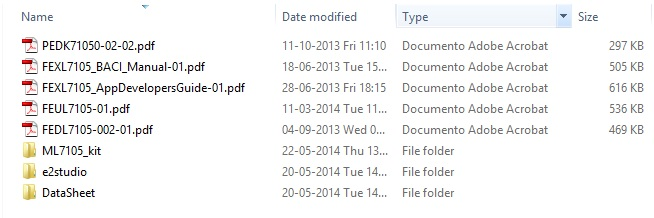

.. Lapis_BLE documentation master file, created by
   sphinx-quickstart on Mon May 19 19:00:11 2014.
   You can adapt this file completely to your liking, but it should at least
   contain the root `toctree` directive.

Welcome to Liberty Board's documentation!
=========================================

:Version: 1.00
:Copyright: (C)2014 Silica an Avnet company
:Date: 30 may 2014

.. image:: _images/silica_big.png

.. index:: index

**INTRODUCTION**
****************

Silica Liberty board is designed to evaluate BlueTooth Low Energy performance. The main processor is a Renesas R5F100EGANA. The board is also equiped with one ML7105 Lapis BLE module, one KXTJ2-1009 Kionix Accelerometer, one BD1020HFV Rohm Temperature sensor and one SMLP34RGB1W Rohm RGB led.

Using a TTL-USB connected with UART_TX_OUT signal of 6 pins header and a Terminal SW on the PC (such as HyperTerminal) it's possible to see a "dump" of all data 'send to' and 'received from' ML7105 module. 

BLE_lapis FW project is based on **VSSPP_ML610QXXX_Ver0_094_beta** firmware revision developed for Lapis PEXL7105_WSN kit and adapted for Silica Liberty Board. It is adapted for VSP application; no test has been made for VSSPP application.

.. _toolset:

Liberty developement tools
--------------------------

Firmware was developed using:
 - e2studio Version 2.2.0.13 based on Eclipse SDK 3.8.2 and CDT 8.2.1.  (`click here to download e2studio 2.2.0.13 <https://update.renesas.com/gur/authenticate.do?regionCode=am&languageCode=en&url=http%3A%2F%2Fam.renesas.com%2Fsupport%2Fdownloads%2Fjq_download_category%2Fide%2FRenesas_e2_studio_2.2.0.13.exe/>`_ ) 
 - KPIT GNURL78 Version 13.02-ELF-MP1 compiler (`click here to download GNURL78 13.02 <http://www.kpitgnutools.com/showFileDesc.php?hidTcId=938&hidCatName=sc_KPIT_GNU_Tools/>`_ ) 
 
.. note::
 **Registration is needed before to be able to download these files!**
 
.. important::
 e2studio 2.2.0.13 or KPIT GNURL78 13.02-ELF-MP1 are also available on request. In this case, you must register at Renesas and KPIT official sites for license activaction 

.. _email:

GNURL78 registration email
--------------------------
.. important::
 **After registration on KPIT site, you receive email such as follow:**
 
 | Welcome to KPIT GNU Tools
 | Dear YourName,
 | Thank you.
 | Your registration with KPITCummins has been successful with the following registration details:

 | Login Details:
 | 1. User Name: YourEmail
 | 2. Password: YourPassword

 | Personal Details:
 | 3. Name: YourName
 | 4. Email Address: YourEmail
 | 5. Activation Code: **YourCode**
 | 6. Address: 
 | 7. Telephone Number: 

 | Company Details:
 | 8. Name: 
 | 9. Address: 
 | 10. Telephone Number: 
 | 11.URL: 
 | 12.Position: 
 
 **Please, note that YourCode is requested during first time GNUKPIT installation!!**
 
 You can also find a video guide `here <http://knowledgebase.am.renesas.com/03Development_Tools/IDEs_and_Project_Managers/e2studio/Downloading_and_installing_free_GNU_toolchains_for_use_with_e2studio/>`_

**Firmware project is included into Liberty.zip archive file** 

Documents references
--------------------

Reference guide and datasheet are included into Liberty_doc.zip archive file and are:
 - PEDK71050-02-02.pdf --> ML7105 Module DataSheet (used in this project)
 - FEXL7105_BACI_Manual-02.pdf --> ML7105 Baci interface specifications
 - FEUL7105-01.pdf --> ML7105 User's Manual
 - FEDL7105-002-01.pdf --> ML7105 DataSheet
 - ML7105_kit folder that contains:
	- FEXL7105_WSNapp-01.pdf --> ML7105 WSN Lapis kit user's manual
	- PEXL7105_WSN_HardManual-03.pdf --> ML7105 Lapis kit hardware manual
 - e2studio folder that contains:
	- r20ut2771ej0100_e2_start_s.pdf --> e2studio quick start
 - DataSheet folder that contains:
	- bd1020hfv-e.pdf --> Temperature sensor IC
	- KXTJ2-1009 Specification Rev 4.pdf --> Accelerometer
	- RL78_G13_Hardware.pdf --> Renesas RL78 series hardware manual
	- SMLP34RGBxW_last.pdf --> RGB Led 
	

	
You can download the Liberty.zip and Liberty_doc.zip accessing to Silica Architech website *(registration is needed for download)*

**Installing E2studio and KPIT Developement Suite** chapter will guide you through the basic steps of the installation procedure of Developement Suite

We suggest you to read first the Quick Start Guide to perform a correct setup. 

:ref:`quick`

This guide explains how to use this application and provides an overview of on the structure of the project firmware

Contents:

.. toctree::
   :maxdepth: 3
   
   quick
   E2Inst
   PrjFiles
   ftips
   link_file

