.. _quick:

Quick start guide
*****************

Hardware requirements
---------------------

- Silica Liberty Board kit
- One TTL-USB adapter (for communication dump)
- Renesas E1 on-chip debugger
- PC with terminal software (such as HyperTerminal)

::

 **TODO Liberty board image**
 **TODO Dscription of board features**

Software requirements
---------------------

- e2studio Version 2.2.0.13 and KPIT GNURL78 Version 13.02-ELF-MP1 compiler
- Liberty_BLE_v1 firmware 
- PC terminal emulator (such as HyperTerminal)
- PC software Liberty (to connect with Liberty board)

.. note::

 | **If you have not yet installed e2studio develepoment suite, before proceeding, go to:**
 | :ref:`E2studio Suite Install`
 

HyperTerminal settings
----------------------

Set your HyperTerminal COMx parameter:

| speed = 115200 baud
| data with =  8
| parity = none
| stop bit = 1
| flow control = none 

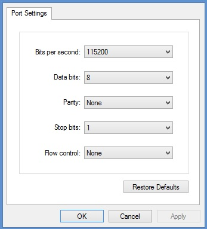

.. _hwset:

Hardware setup
--------------
Plug the Battery into socket adapter (see figure below)

Red led will ON to indicate initial settings (if connected, you can see the commnication dump on PC HyperTerminal)

After initialization, the green led will flash every 2 second to indicate that Liberty is in active state waiting connection.

Try to connect an pair with Liberty PC software, the green led will lamp (half second period), and after the yellow light means "device paired"
See at Liberty PC Software user guide to perfom basic functions with Liberty board. 

For debugging purpose, you can use Renesas E1 on-chip debugger. You must have a cable adapter to connect emulator pod with Liberty board

::

 **TODO image e1**
 **TODO decription of E1 connection with board
 **TODO image cable adapter**

Liberty Board FW installation & setup
-------------------------------------

.. tip::
 **Install first E2studio develepoment suite, then proceed with firmware setup**
 
 
- Inside E2studio workspace folder (C:\\Users\\ *MyUserName* \\My Documents\\e2_studio\\workspace) create new folder named **Liberty_BLE_v1** 

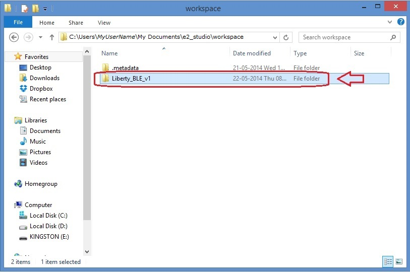

- Unzip all files from Liberty_BLE_v1.zip into the folder **C:\\Users\\** *MyUserName* **\\My Documents\\e2_studio\\workspace\\Liberty_BLE_v1** just created 

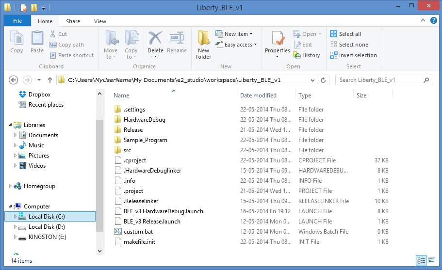

- Go to Start --> Renesas Electronics e2 studio --> Renesas e2 studio --> Eclipse and click on to start E2studio suite

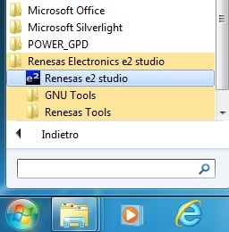

- Check if workspace setting is like figure below. Then click OK to proceed.

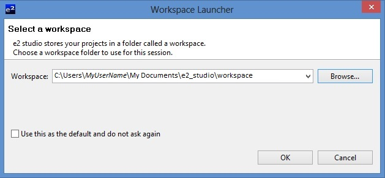

- Now you can see the Eclipse Main Window

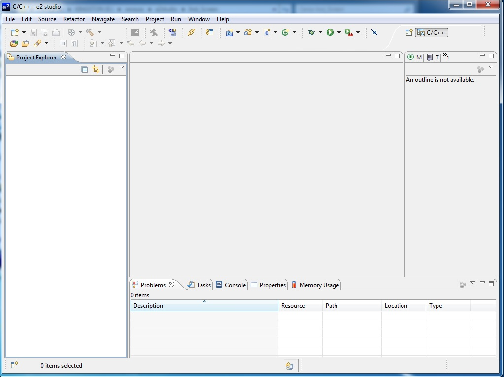

- Select menu File --> Import

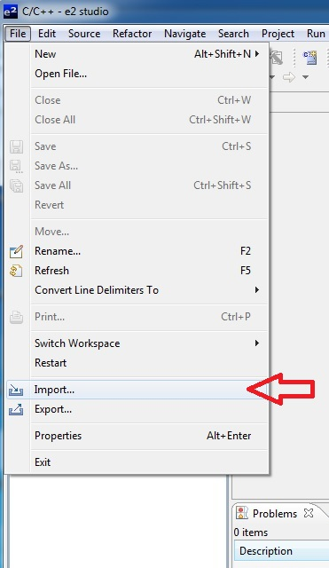

- In the dialog box that will open, click on **General**, select **Existing Projects Into Workspace** and after click "Next" button: new dialog will open.

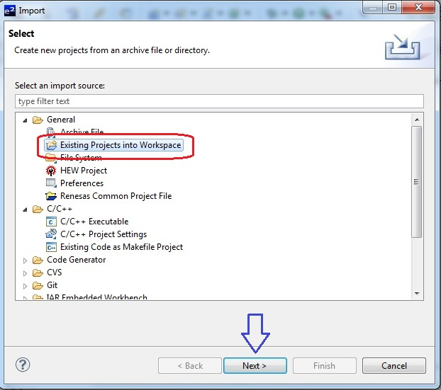

- Click on "Browse..." button an navigate to C:\\Users\\ *MyUserName* \\My Documents\\e2_studio\\workspace\\Liberty_BLE_v1 folder. Click on "OK" button

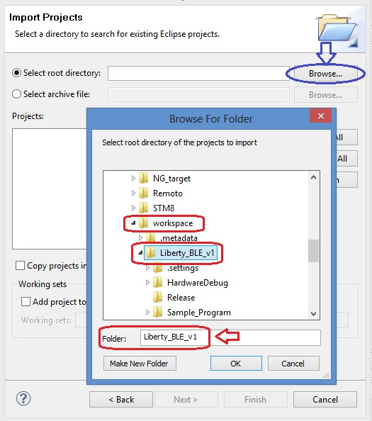

- Check options and setting as the image below, then click "Finish" button to import project.

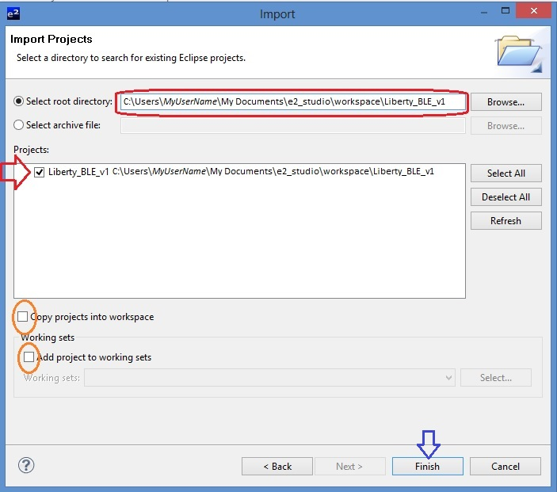

- Wait for project import, then you can see Liberty_BLE_v1 project in the Project Explorer windows of E2studio Platform.

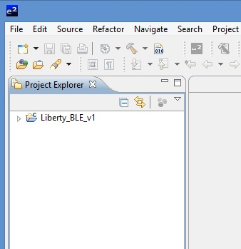

- **First of all**, open project tree by clicking on the arrow located at left of project name *(orange circled)*. 

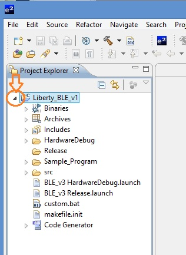

- Now, right click over "Liberty_BLE_v1" in the Project Exporer window to point out it, then select "Clean Project". 

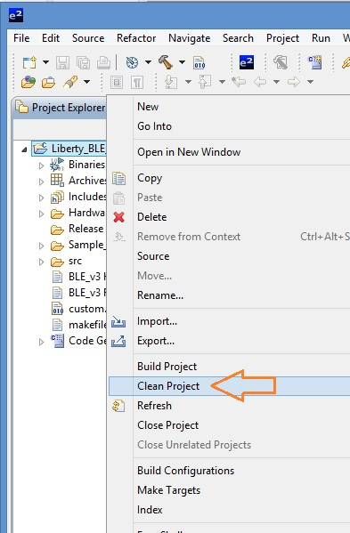

- When clean has benn made, point mouse over hammer icon on the toolbar and click it (see image below). Hardware debug build will start.

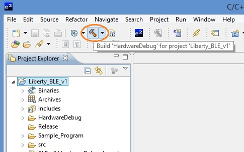

.. note:: **Don't care if you have this warning in the Problems tab (see image above)**
 
 .. image:: _images/build.jpg

**Now you are ready to work with Liberty_BLE_v1 project**

